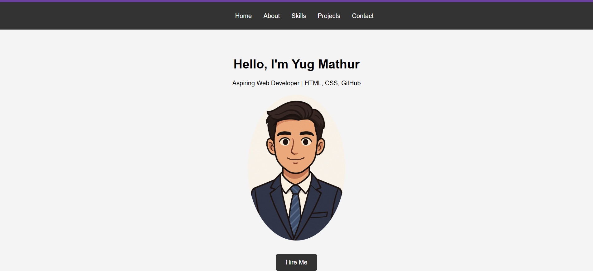

# MyPortfolio Website

A simple and responsive personal portfolio website built using HTML and CSS.  
This project showcases personal information, skills, projects, and a contact section with a clean and modern UI design.

---

## 🚀 Features

- Responsive Navigation Bar
- Hero / Home Section
- About Me Section
- Skills Section
- Projects Showcase
- Contact Form
- Circular Profile Image
- Clean and Modern UI
- Beginner-Friendly Project
- Smooth Layout using CSS

---

## 🛠️ Technologies Used

- HTML5
- CSS3
- Git
- GitHub

---

## 📂 Project Structure

```bash
MyPortfolio/
│
├── index.html
├── style.css
├── profile.jpeg
└── README.md
```

---

## 📸 Website Preview



---

## 📖 Sections Included

### 🏠 Home

- Introduction section
- Profile image
- Hire Me button

### 👨‍💻 About

A short introduction about learning web development and building projects.

### ⚡ Skills

- HTML
- CSS
- Responsive Design
- Git & GitHub

### 📁 Projects

- Portfolio Website
- Student Registration Form
- Product Landing Page

### 📞 Contact

Simple contact form with:

- Name
- Email
- Message

---

## 🎯 Future Improvements

- Add JavaScript functionality
- Add animations
- Improve mobile responsiveness
- Connect contact form with backend
- Add dark mode

---

## 🌐 Live Demo

https://yugmathur05.github.io/My_Portfolio/

---

## ▶️ How to Run

1. Clone the repository

```bash
git clone https://github.com/YugMathur05/project_deploy.git
```

2. Open the project folder

3. Run `index.html` in your browser

---

## 👨‍💻 Author

Yug Mathur

GitHub: https://github.com/YugMathur05

---

## 📄 License

This project is open-source and free to use.
